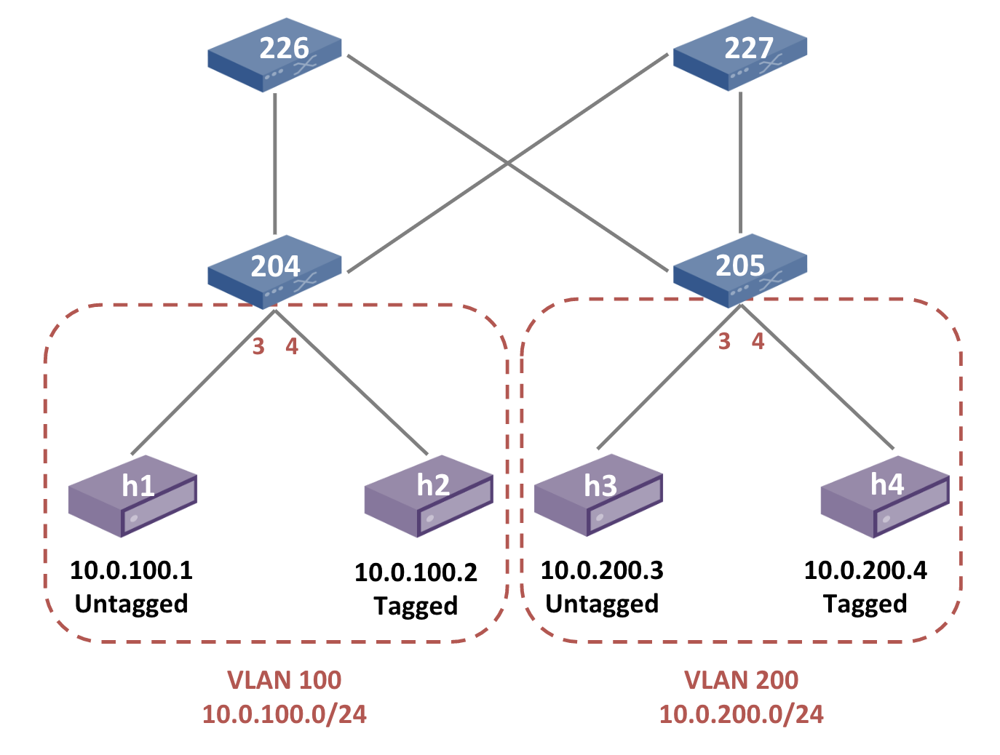

# Trellis+P4 Tutorial Lab 1 - Trellis Basics

The goal of this exercise is to learn how to set up an emulated Trellis
environment with a simple 2x2 topology and basic configuration.

To run this exercise you will need multiple terminal windows (or tabs) to
operate with the CLI of Mininet and ONOS. We use the following convention
to distinguish between commands of different CLIs:

* Commands starting with `$` are intended to be executed in the Ubuntu terminal
    prompt;
* `onos>` for commands in the ONOS CLI;
* `mininet>` for the Mininet CLI.

## Topology


## Exercise steps

1. On terminal window 1, **start ONOS with a subset of Trellis apps**
by executing the following command:

    ```
    $ cd $ONOS_ROOT
    $ export ONOS_APPS=segmentrouting,drivers.bmv2,pipelines.fabric,lldpprovider,hostprovider,netcfghostprovider
    $ ok clean
    ```

    The `$ONOS_ROOT` environment variable points to the root ONOS directory.
    `ONOS_APPS` is used to indicated which ONOS applications to automatically
    load when starting ONOS. The `ok` command is an alias to run ONOS locally in
    your dev machine. Please note that if this the first time you run ONOS on
    this machine, or if you haven't built ONOS before, it can take some time
    (5-10 minutes depending on your Internet speed).

    Once ONOS has started you should see log messages being print on the screen.

2. On terminal window 2, **push the network configuration to ONOS**.

    ```
    $ onos-netcfg localhost ~/trellis-p4-tutorial/lab1/trellisp4.json
    ```

    The `onos-netcfg` command can be used to push a JSON network config to any
    running ONOS instance. In this case, we are running ONOS locally and hence
    `localhost`.

3. On terminal window 2, **open the ONOS CLI to verify the system is up an
running**.

    1. Use the following command to **access the ONOS CLI**:

        ```
        $ onos localhost
        ```

        You should now see the ONOS CLI command prompt. For a list of possible
        commands that you can use here, type:

        ```
        onos> help onos
        ```

    2. To **verify that you have activated all the required apps**, run the
    following command:

        ```
        onos> apps -a -s
        ```

        Make sure you see the following list of apps displayed:

        ```
        * ... org.onosproject.route-service         ... Route Service Server
        * ... org.onosproject.drivers               ... Default Drivers
        * ... org.onosproject.lldpprovider          ... LLDP Link Provider
        * ... org.onosproject.hostprovider          ... Host Location Provider
        * ... org.onosproject.protocols.grpc        ... gRPC Protocol Subsystem
        * ... org.onosproject.protocols.p4runtime   ... P4Runtime Protocol Subsystem
        * ... org.onosproject.protocols.gnmi        ... gNMI Protocol Subsystem
        * ... org.onosproject.generaldeviceprovider ... General Device Provider
        * ... org.onosproject.drivers.gnmi          ... gNMI Drivers
        * ... org.onosproject.p4runtime             ... P4Runtime Provider
        * ... org.onosproject.drivers.p4runtime     ... P4Runtime Drivers
        * ... org.onosproject.mcast                 ... Multicast traffic control
        * ... org.onosproject.segmentrouting        ... Segment Routing
        * ... org.onosproject.pipelines.basic       ... Basic Pipelines
        * ... org.onosproject.netcfghostprovider    ... Network Config Host Provider
        * ... org.onosproject.pipelines.fabric      ... Fabric Pipeline
        * ... org.onosproject.drivers.bmv2          ... BMv2 Drivers
        ```

    3. Enter the following ONOS command to **verify the network config**:

        ```
        onos> netcfg
        ```

        You should see 4 devices and 3 ports configured.

    4. *Verify the interface configuration* using the following ONOS command:

        ```
        onos> interfaces
        ```

        You should see 3 interfaces configured with the same information contained in the netcfg.

        ```
        onos> interfaces
        if1: port=device:bmv2:s204/3 ips=[10.0.100.254/24] mac=00:00:00:00:02:04 vlanUntagged=100
        if2: port=device:bmv2:s204/4 ips=[10.0.100.254/24] mac=00:00:00:00:02:04 vlanTagged=[100]
        if3: port=device:bmv2:s205/3 ips=[10.0.200.254/24] mac=00:00:00:00:02:05 vlanUntagged=200
        ```

4. (optional) **Change flow rule polling interval**. Run the following
    command in the ONOS CLI:

    ```
    onos> cfg set org.onosproject.net.flow.impl.FlowRuleManager fallbackFlowPollFrequency 5
    ```

    This command tells ONOS to check the state of flow rules on switches
    every 5 seconds (default is 30). This is used to obtain more often flow
    rules stats such as byte/packet counters. It helps also resolving more
    quickly issues where some flow rules are installed in the ONOS store but
    not on the device (which can often happen when emulating a large number
    of devices in the same VM).

5. On terminal window 3, **run a Mininet script to set up a topology of BMv2
devices**.

    1. To **run Mininet**, use the following command:

        ```
        cd ~/trellis-p4-tutorial/lab1
        sudo -E ./trellisp4.py --onos-ip 127.0.0.1
        ```

        The `trellisp4.py` script uses the Mininet Python API to create a
        virtual topology as the one depicted above by using BMv2 software
        switches.

        The `--onos-ip` argument specifies the address of the ONOS controller
        which is running on the same machine where we are executing Mininet.

    2. A set of **files are generated in the `/tmp` folder as part of this
        script**, to view them (on a separate terminal window):

        ```
        $ ls /tmp/bmv2-*
        ```

    3. You will **find ONOS netcfg JSON files in this folder** for each BMv2
        switch, open this file up, for example:

        ```
        $ cat /tmp/bmv2-s204-netcfg.json
        ```

        It contains the configuration for (1) the gRPC server and port used by the
        BMv2 switch process for the P4Runtime service, (2) the ID of pipeconf to
        deploy on the device, (3) switch ports details, and other
        driver-specific information.

        **This file is pushed to ONOS automatically by Mininet when executing
        the switch instance**. If everything went as expected, you should see
        the ONOS log populating with messages like:

        ```
        Connecting to device device:bmv2:s204 with driver bmv2
        [...]
        Setting pipeline config for device:bmv2:s204 to org.onosproject.pipelines.fabric...
        [...]
        Device device:bmv2:s204 connected
        [...]
        ```

        The log will also show warn messages like:

        ```
        Cannot translate DefaultForwardingObjective: unsupported forwarding function type 'PSEUDO_WIRE'...
        ```

        This is expected, as not all Trellis features are supported today with
        `fabric.p4`. One of these features is pseudo-wires.

    4. **Check the flow rules inserted by each app in ONOS**. In the
        ONOS CLI type:

        ```
        onos> flows -c
        ```

        You should see the following amount of flow rules on each device:

        ```
        deviceId=device:bmv2:s205, flowRuleCount=33
        deviceId=device:bmv2:s227, flowRuleCount=26
        deviceId=device:bmv2:s204, flowRuleCount=32
        deviceId=device:bmv2:s226, flowRuleCount=26
        ```

        You can also run the following command to view all of the flows.

        ```
        onos> flows -s
        ```

        These flows are generated and inserted by the Trellis apps
        (`segmentrouting` among all), in response to the network config and the
        topology discovered by ONOS.

6. **Visualize the topology using the ONOS web UI**

    Open a browser from within the tutorial VM (e.g. Firefox) to
    <http://127.0.0.1:8181/onos/ui/>. When asked, use the username `onos`
    and password `rocks`.

    While here, feel free to interact with and discover the ONOS UI. For more
    information on how to use the ONOS web UI please refer to this guide:
    <https://wiki.onosproject.org/x/OYMg>

    To show or hide switch labels, press `L` on your keyboard.

7. It is finally time to **test connectivity between the hosts** of our Mininet
network.

    1. On the Mininet prompt, **start a ping between host 1 and host 3**:

        ```
        mininet> h1 ping h3
        ```

        The **ping should NOT work**, and the reason is that the hosts are not
        discovered by ONOS yet. In a more complicated setup where the DHCP relay
        app is in use, ONOS can learn host information when the host is
        requesting an IP address using DHCP. However, in this simple topology,
        ONOS only learns host information from ARP requests intercepted in the
        network. We need to generate ARP requests.

    2. To have ONOS discover the hosts, we can **generate ARP packets** by the
    following commands:

        ```
        mininet> h1 arping 10.0.100.254
        mininet> h2 arping 10.0.100.254
        mininet> h3 arping 10.0.200.254
        mininet> h4 arping 10.0.200.254
        ```

        In the ONOS log, you should see messages like:

        ```
        Host 00:AA:00:00:00:01/None is added at [device:bmv2:s204/3]
        ...
        Populating bridging entry for host 00:AA:00:00:00:01/None at device:bmv2:s204:3
        Populating routing rule for 10.0.100.1 at device:bmv2:s204/3
        ```

        You should also notice that **arp-pinging for host 4 does not work**.
        The reason is that we have not configured the interface that host 4
        attaches to. You will have to configure this interface in the next steps
        of this exercise.

        The `*.254` addresses are the same configured in the `trellisp4.json`
        files and are the IPv4 addresses assigned to each interface of the leaf
        switches. In this case, by arp-pinging these addresses, we are
        generating ARP requests that are intercepted by ONOS.

        Moreover, since these are the IPv4 addresses of the leaf interfaces,
        ICMP pings are handled directly by ONOS, which intercepts the ping
        request and generates a ping reply that is injected in the network by
        means of a P4Runtime packet-out operation. This is equivalent to pinging
        the interface of a traditional router.

    3. Execute the following command to **verify that all hosts are discovered**:

        ```
        onos> hosts -s
        ```

        You should see 3 hosts.

    4. Start a ping between hosts. This time h1, h2 and h3 should be able to
    ping each other:

        ```
        mininet> h1 ping h3
        mininet> h1 ping h2
        mininet> h2 ping h3
        ```

8. It is time to **configure a new interface for host 4**. For this, we need to
update the network config:

    1. Modify `trellisp4.json`: in the `ports` section of the file, add a new
    interface configuration for the port that host 4 attaches to (port 4 of
    switch `s205`).

    2. You can copy the configuration of another port. However, you may need to
    change the device ID, port number, subnet or VLAN information accordingly.
    
        From the topology diagram above, rember that host 4 is a "tagged" host
        sending packets with VLAN tag `200`, and that it belongs to the subnet
        `10.0.200.0/24`. Hence, make sure that the new interface configuration
        contains a `vlan-tagged` property and that the interface IP is in the
        same subnet, for example you can choose `10.0.200.254/24`.

    3. If you struggle to make it work, please ask the instructors for help.
    Alternatively, you can find the solution in
    [solution/trellisp4.json](solution/trellisp4.json).
    
    4. Follow commands of step 7 to have ONOS discover host 4 (via `arping`).
    
    5. Finally, you should be able to ping from host 4 to all other hosts.

**Congratulations, you completed the first lab of the Trellis+P4 tutorial!**
