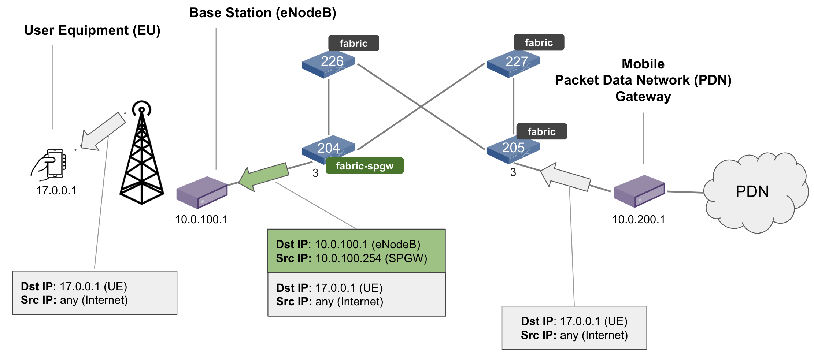
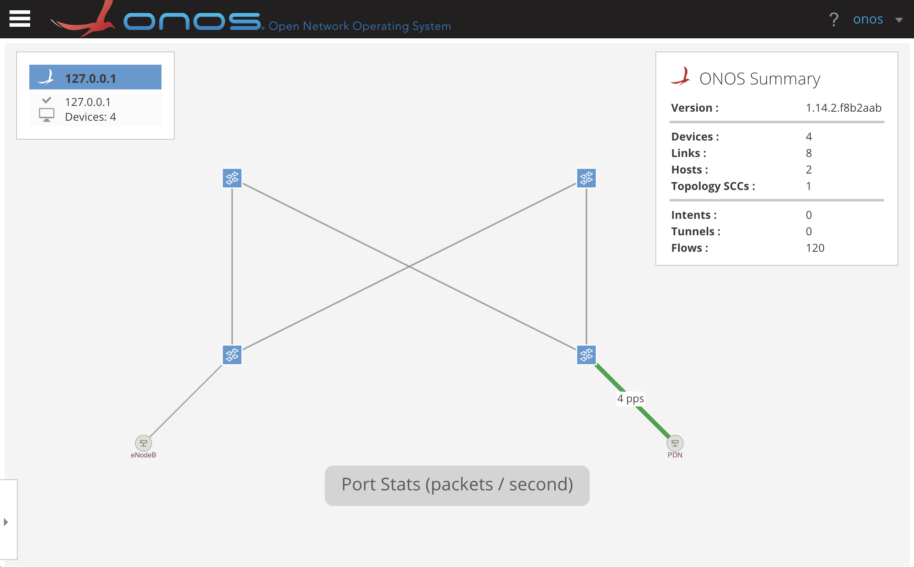
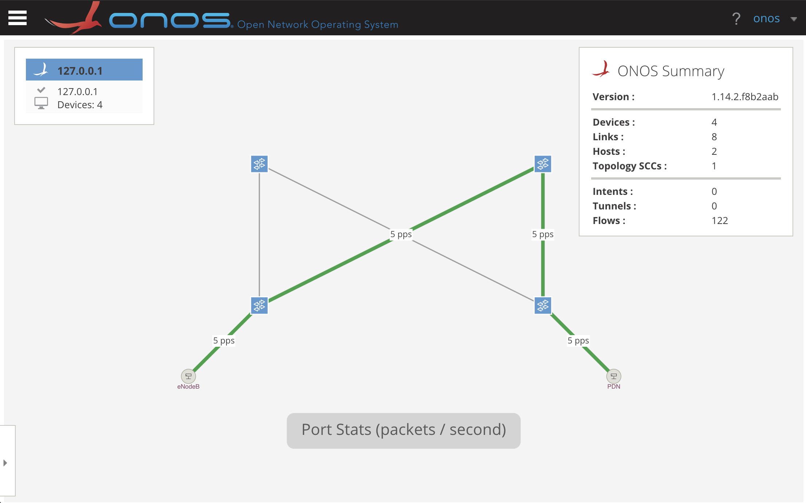

# Trellis+P4 Tutorial Lab 2 - GTP encapsulation

The goal of this exercise is to learn how to configure Trellis and fabric.p4 to encapsulate
packets using the GTP header as in a mobile Serving and Packet Gateway (S/PGW).

## Topology


## Exercise steps

1. **Modify the ONOS network config to use the fabric-spgw profile on leaf switch
s204**.

    1. Open file `trellis-gtp.json` and look for the device configuration of
    switch s204. It should look like this:
    
        ```
        "devices": {
            "device:bmv2:s204": {
              "piPipeconf": {
                "piPipeconfId": "org.onosproject.pipelines.fabric"
              },
              "segmentrouting": {
                "name": "s204",
                "ipv4NodeSid": 204,
        ...
        ```
    
    2. Modify the `piPipeconfId` property to use the `fabric-spgw` profile. In
    other words, replace `org.onosproject.pipelines.fabric` with
    `org.onosproject.pipelines.fabric-spgw`.

    3. Save the file.
    
2. Using commands similar to lab 1, **start ONOS, start Mininet, and push the
network config file**:

    1. On terminal window 1, **start ONOS** with a subset of Trellis apps
    by executing the following command:
    
        ```
        $ cd $ONOS_ROOT
        $ export ONOS_APPS=segmentrouting,drivers.bmv2,pipelines.fabric,lldpprovider,hostprovider,netcfghostprovider
        $ ok clean
        ```
        
        Using the ONOS CLI, make sure that the following apps are running. To
        access the ONOS CLI:
        
        ```
        $ onos localhost
        ```
        
        To show the apps active:
        
        ```
        onos> apps -a -s
        * ... org.onosproject.route-service         ... Route Service Server
        * ... org.onosproject.drivers               ... Default Drivers
        * ... org.onosproject.lldpprovider          ... LLDP Link Provider
        * ... org.onosproject.hostprovider          ... Host Location Provider
        * ... org.onosproject.protocols.grpc        ... gRPC Protocol Subsystem
        * ... org.onosproject.protocols.p4runtime   ... P4Runtime Protocol Subsystem
        * ... org.onosproject.protocols.gnmi        ... gNMI Protocol Subsystem
        * ... org.onosproject.generaldeviceprovider ... General Device Provider
        * ... org.onosproject.drivers.gnmi          ... gNMI Drivers
        * ... org.onosproject.p4runtime             ... P4Runtime Provider
        * ... org.onosproject.drivers.p4runtime     ... P4Runtime Drivers
        * ... org.onosproject.mcast                 ... Multicast traffic control
        * ... org.onosproject.segmentrouting        ... Segment Routing
        * ... org.onosproject.pipelines.basic       ... Basic Pipelines
        * ... org.onosproject.netcfghostprovider    ... Network Config Host Provider
        * ... org.onosproject.pipelines.fabric      ... Fabric Pipeline
        * ... org.onosproject.drivers.bmv2          ... BMv2 Drivers
        ```
    
    2. On a new terminal window 2, **start the Mininet topology** for this
    exercise:
    
        ```
        $ cd ~/trellis-p4-tutorial/lab2
        $ sudo -E ./trellis-gtp.py --onos-ip 127.0.0.1
        ```
    
    3. On a terminal window 3, **push the network configuration to ONOS**.
                               
        ```
        $ cd ~/trellis-p4-tutorial/lab2
        $ onos-netcfg localhost trellis-gtp.json
        ```
    
3. Verify that the environment has been configured correctly:

    1. Wait for ONOS to connect to all BMv2 switches and for Trellis to apply
    the necessary flow objectives. When ONOS stops printing messages in the log
    (meaning that is done processing the network config), use the ONOS CLI to
    check that all devices have been discovered:
   
        ```
        onos> devices -s
        id=device:bmv2:s204, available=true, role=MASTER, type=SWITCH, driver=bmv2:org.onosproject.pipelines.fabric-spgw
        id=device:bmv2:s205, available=true, role=MASTER, type=SWITCH, driver=bmv2:org.onosproject.pipelines.fabric
        id=device:bmv2:s226, available=true, role=MASTER, type=SWITCH, driver=bmv2:org.onosproject.pipelines.fabric
        id=device:bmv2:s227, available=true, role=MASTER, type=SWITCH, driver=bmv2:org.onosproject.pipelines.fabric
        ```
   
        **Make sure that switch `s204` is running the `fabric-spgw` profile!**
   
    2. Check that the two hosts (eNodeB and PDN) have been discovered:
   
        ```
        onos> hosts -s
        id=00:AA:00:00:00:01/None, mac=00:AA:00:00:00:01, locations=[device:bmv2:s204/3], vlan=None, ip(s)=[10.0.100.1]
        id=00:AA:00:00:00:02/None, mac=00:AA:00:00:00:02, locations=[device:bmv2:s205/3], vlan=None, ip(s)=[10.0.200.1]
        ```
        
        ONOS should be already aware of the two hosts even if we did not
        generate any ARP request, as these hosts are statically configured in
        the `trellis-gtp.json` netcfg file (look for for the `hosts` section).
       
    3. Verify that two interfaces are configured (one for the eNodeB and one for
    the PDN):

        ```
        onos> interfaces
        if-enodeb: port=device:bmv2:s204/3 ips=[10.0.100.254/24] mac=00:00:00:00:02:04 vlanUntagged=100
        if-pdn: port=device:bmv2:s205/3 ips=[10.0.200.254/24] mac=00:00:00:00:02:05 vlanUntagged=200
        ```
    
    4. Check the flow rules count:
    
        ```
        onos> flows -c
        deviceId=device:bmv2:s205, flowRuleCount=34
        deviceId=device:bmv2:s227, flowRuleCount=26
        deviceId=device:bmv2:s204, flowRuleCount=34
        deviceId=device:bmv2:s226, flowRuleCount=26
        ```
    
    5. Finally, verify that there is connectivity between the eNodeB and the PDN.
    
        Using Mininet, start a ping between the `enodeb` and `pdn` hosts:
        
        ```
        mininet> enodeb ping pdn
        PING 10.0.200.1 (10.0.200.1) 56(84) bytes of data.
        64 bytes from 10.0.200.1: icmp_seq=1 ttl=62 time=2.13 ms
        64 bytes from 10.0.200.1: icmp_seq=2 ttl=62 time=2.44 ms
        ...
        ```
        
4. **Start the eNodeB and PDN processes**:

    1. On a new terminal window, start the PDN process:
    
        ```
        $ cd ~/trellis-p4-tutorial/lab2
        $ sudo -E sudo ./pdn.py
        ```
        
        This process emulates the PDN network by sending downlink packets (i.e.
        from the Internet to the UE). Generated packets will have destination
        IPv4 address `17.0.0.1` (UE address). In the rest of the exercise we
        will configure Trellis to route these packets through switch `s204`, and
        we will insert a flow rule in this switch to perform the GTP
        encapsulation.

    2. On a new terminal window, start the eNodeB process:
    
        ```
        $ cd ~/trellis-p4-tutorial/lab2
        $ sudo -E sudo ./enodeb.py
        ```
        
        This process simply sniffs packets received on the eNodeB interface
        (`s204-eth3`) and prints them, informing if the packet is GTP
        encapsulated or not. You should see no packets being printed for the
        moment.

5. Use the ONOS UI to visualize that packets are being dropped at switch `s205`:

    Open a browser from within the tutorial VM (e.g. Firefox) to
    <http://127.0.0.1:8181/onos/ui/>. When asked, use the username `onos`
    and password `rocks`.
    
    To show real-time link utilization, press `A` on your keyboard multiple
    times until showing `Port stats (packets / second)` as in the figure below:
    
    
    
    **Packets are dropped at switch `s205` as this does not know how to route
    packets with IPv4 destination `17.0.0.1`**!

6. **Add Trellis static route for the UE subnet**:

    1. Using the ONOS CLI, type the following command to add a route for the UE
    subnet (`17.0.0.0/24`) with next hop the eNodeB (`10.0.100.1`):
    
        ```
        onos> route-add 17.0.0.0/24 10.0.100.1
        ```
        
        Check that the new route has been successfully added:
        
        ```
        onos> routes
        B: Best route, R: Resolved route
        
        Table: ipv4
        B R  Network            Next Hop        Source (Node)
        > *  17.0.0.0/24        10.0.100.1      STATIC (-)
           Total: 1
        ...
        ```
    
    2. Check the eNodeB process to make sure packets are now received. You
    should see the following lines being printed for every packet received:
    
        ```
        Received packet of 691 bytes: 10.0.200.1 -> 17.0.0.1, gtpEncap=FALSE :(
        ```
    
        **Packets are now delivered to the eNodeB, but they are not encapsulated
        with the GTP header yet**.

    3. Use the ONOS UI to visualize the routed packets as in the figure below:
    
        
    
7. Using ONOS REST APIs, **insert a flow rule on switch `s204` to perform the
GTP encapsulation**:

    1. Open the file `gtp-flowrule.json` which specifies a flow rule for the
    table `dl_sess_lookup` of the `fabric-spgw` profile. This table is used to
    process packets in the downlink direction of a S/PGW. The table matches on
    the IPv4 destination address, and for matched packets it allows to specify
    the information of the GTP header to apply using the `set_dl_sess_info`
    action.
    
    2. This file is incomplete and you need to modify it before adding the flow
    rule.
    
        Look for the `selector` section that specifies the match fields:
    
        ```
        "selector": {
          "criteria": [
            {
              "type": "IPV4_DST",
              "ip": "<INSERT HERE UE IP ADDR>/32"
            }
          ]
        },
        ...
        ```
        
        **Modify the `ip` field to match on the IP address of the UE
        (17.0.0.1).**
        
        Since the `dl_sess_lookup` table performs exact match on the IPv4
        address, make sure to specify the match field with `/32` prefix length.
        
        Also, note that the `set_dl_sess_info` action, is specified as a
        `PROTOCOL_INDEPENDENT`. This is the ONOS terminology to describe custom
        flow rule actions. For this reason, the action parameters are specified
        as byte strings in hexadecimal format:
        
        * `"teid": "BEEF"`: GTP tunnel identifier (48879 in decimal base)
        * `"s1u_enb_addr": "0a006401"`: destination address of the GTP outer
        IPv4 header (10.0.100.1). This is the address of the eNodeB.
        * `"s1u_sgw_addr": "0a0064fe"`: source address of the GTP outer IPv4
        header (10.0.100.254). This is the address of the switch interface
        configured in Trellis.
        
    3. Save the `gtp-flowrule.json` file.
    
    4. Push the flow rule file to ONOS using REST APIs.
    
        On a new terminal window, type the following commands:
        
        ```
        $ cd ~/trellis-p4-tutorial/lab2
        $ ./add-gtp-rule.sh
        ```
        
        If the flow rule has been inserted correctly, you should see an output
        similar to the following one:
        
        ```
        + curl --fail -sSL --user onos:rocks --noproxy 127.0.0.1 -X POST -H 
        Content-Type:application/json 'http://127.0.0.1:8181/onos/v1/flows?appId
        =trellis-tutorial' -d@gtp-flowrule.json
        {"flows":[{"deviceId":"device:bmv2:s204","flowId":"52072873213960115"}]}
        ```
        
    5. Check the eNodeB process. You should now see that the received packets
    are GTP encapsulated.
    
        ```
        Received packet of 727 bytes: 10.0.100.254 -> 10.0.100.1, gtpEncap=TRUE :)
        ```

8. Use Wireshark to visualize packets before and after the GTP encapsulation.

    1. Open Wireshark using the icon in the desktop.
    
    2. Start a dump on interface `s205-eth3`, which is the port facing the PDN.
    
    3. Compare this dump to that obtained from interface `s204-eth3`, which is
    the port facing the eNodeB.

**Congratulations, you completed the second lab of the Trellis+P4 tutorial!**
